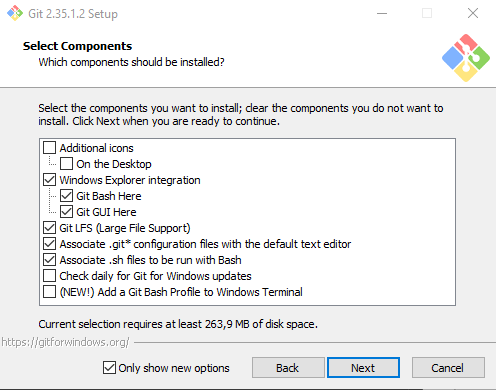

### PRAKTIKUM TEKNOLOGI CLOUD

##### NAMA : HENI RAHMA DIANI

##### NIM : 215611105

# A. INSTALLASI GIT di WINDOWS

Sebelum install Git di Windows kita perlu mendownload GIT terlebih dahulu.

1. Setelah selesai download Git, jalankan program GIT. Akan dimunculkan lisensi. Klik Next untuk lanjut.

   

2. Setelah itu, pilih lokasi instalasi. Secara default akan terisi C:\Program Files\Git. Ganti lokasi jika memang anda menginginkan lokasi lain. Klik Next untuk lanjut.

   

3. Pilih komponen. Tidak perlu diubah-ubah, sesuai dengan default saja. Klik pada Next

   

4. Proses install Git

   

5. Jika selesai akan muncul dialog pemberitahuan. Klik pada Finish.

   

6. Untuk menjalankan, dari Start, ketikkan "Git", akan muncul beberapa pilihan. Pilih "Git Bash" atau "Git GUI".

   

7. Tampilan jika akan menggunakan Git Bash

   

8. Tampilan jika akan menggunakan Git GUI

   

9. Untuk mencoba dari command prompt, masuk ke command prompt, setelah itu eksekusi "git --version" untuk melihat apakah sudah terinstall atau belum. Jika sudah terinstall dengan benar, makan akan muncul hasil berikut:

   

# B. KONFIGURASI GIT

Untuk melakukan konfigurasi GIT kita bisa melakukan melalui Command prompt dengan memakai perintah sebagai berikut.

1. Konfigurasi Username dan Email Isian di bawah harus disesuaikan dengan nama serta email yang digunakan untuk mendaftar di GitHub.

```sh
$ git config --global user.name "Nama Anda di GitHub"
$ git config --global user.email email@domain.tld
```

2. untuk melihat hasil konfigurasi dengan perintah

```sh
$ git config --list
```

Maka hasilnya seperti pada gambar dibawah ini:


# C. Mengelola Repo Sendiri di Account Sendiri

Untuk membuat repo, gunakan langkah-langkan berikut:

1. Klik tanda + pada bagian atas setelah login, pilih New repository

   

2. Isikan nama, keterangan, serta lisensi. Jselain itu bisa dibuat repo Private

   

# D. Mengelola Repo Sendiri di Organisasi

Untuk membuat repo, gunakan langkah-langkan berikut:

1. Masuk pada Organisasi Kalian lalu Klik tanda + pada bagian atas setelah login, pilih New repository

   

2. Isikan nama, keterangan, serta lisensi. Jselain itu bisa dibuat repo Private

   
